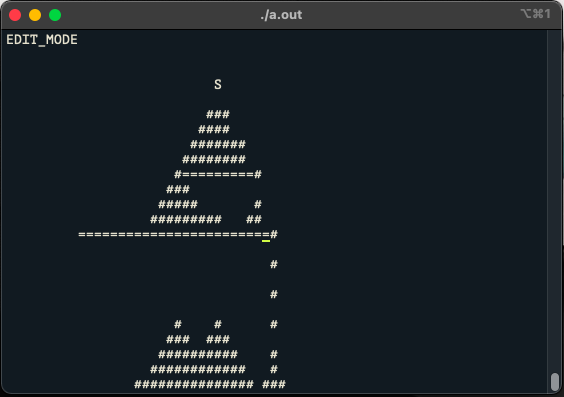

<h1 align="center">Sandsim</h1>
<h3 align="center">A sandbox made of termcaps</h3>

<p> - Little preview</p>



<h6>  Installation :</h6>
```
<p>gcc main.c && ./a.out<p>
```
<h6>  Menu :</h6>
<p>   - SPACE to enter edit mode</p>
<p>   - ESCAPE to enter live mode</p>
<h6>  Controls :</h6>
<p>   - s to summon 1 sand particle</p>
<p>   - S to place a sand generator</p>
<p>   - b to place blocs</p>

- 🌱 Made at 42

[](https://github.com/JaeSeoKim/badge42)
